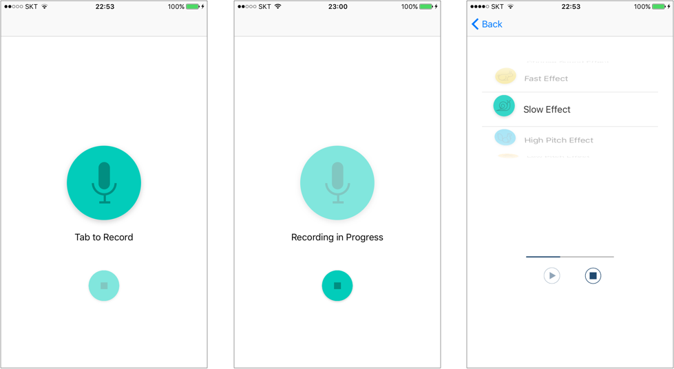
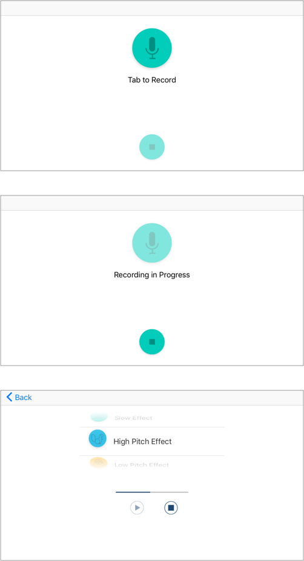

# PitchPerfect Application

### Overview
- - - -
> This application is made for the course **Intro to iOS App Development in Swift** by [Udacity](https://www.udacity.com/course/intro-to-ios-app-development-with-swift--ud585)

**PitchPerfect** Application is a simple AVFoundation app that uses your phone's microphone to record audio and then apply audio effects on the audio. It has six sound effects.

* High pitch sound (Chipmunk image button)
* Low pitch sound (Darth Vader image button)
* Fast sound (Rabbit image button)
* Slow sound (Snail image button)
* Echo sound (Parrot image button)
* Reverb sound (Waveform image button)

### Features
- - - -
* Adaptive screen no matter what your device is.
* Progress view shows the progress of played audio.
* You can choose audio effects through the picker view. So you can understand which icon has an effect that you want.

### At a Glance
- - - -
> If you click this gif file, you can download a full introduction movie about PitchPerfect application :-)

### Screenshot
- - - -
> Screenshots of the application when the screen is portrait.

    
    
> Screenshots of the application when the screen is landscape.

### License
- - - -
Freely provided under the **MIT License**.
